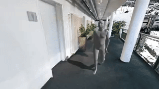

# cloudrender: an OpenGL framework for pointcloud and mesh rendering
A visualization framework capable of rendering large pointclouds, dynamic SMPL models and more. Used to visualize results in our Human POSEitioning System (HPS) project: http://virtualhumans.mpi-inf.mpg.de/hps/

## Requirements
- GPU with OpenGL 4.0 

Optionally, if you want to run included test script:
- EGL support (for headless rendering)
- ffmpeg>=2.1 with libx264 enabled and ffprobe installed (for saving to video)
- SMPL model files (see below)

## Installation
### Step 1. Get the code
Copy the code without installation
```bash
git clone https://github.com/vguzov/cloudrender
pip install -r requirements.txt
```
or install as a package with
```
pip install cloudrender
```
### Step 2. Get the SMPL model (optional, required for human body visualization)
- Follow the installation instructions at https://github.com/vchoutas/smplx
- For legacy version, follow the installation instructions at https://github.com/gulvarol/smplpytorch

## Running test script
### test_scene_video.py
Run `bash download_test_assets.sh` – it will create `test_assets` folder and download assets for the test script.
(human shape and motion files, camera trajectory file)
Additionally, you need to download the 3D scene scan from here: https://edmond.mpg.de/file.xhtml?fileId=274762
and put it as `MPI_Etage6-pc.zip` in `test_assets` folder without unpacking.

Run `test_scene_video.py`, make sure to change `SMPLX_ROOT` path in the script if needed.


The following script will write a short video `test_assets/output.mp4` which should look similar to this:
<p align="center">

</p>

## More data
Please check our HPS project page for more 3D scans and motion data: http://virtualhumans.mpi-inf.mpg.de/hps/

Camera trajectory is created using [CloudVis interactive viewer](https://github.com/vguzov/cloudvis).

## Citation

If you find the code or data useful, please cite: 

```
@inproceedings{HPS,
    title = {Human POSEitioning System (HPS): 3D Human Pose Estimation and Self-localization in Large Scenes from Body-Mounted Sensors },
    author = {Guzov, Vladimir and Mir, Aymen and Sattler, Torsten and Pons-Moll, Gerard},
    booktitle = {{IEEE} Conference on Computer Vision and Pattern Recognition (CVPR)},
    month = {jun},
    organization = {{IEEE}},
    year = {2021},
}
```
